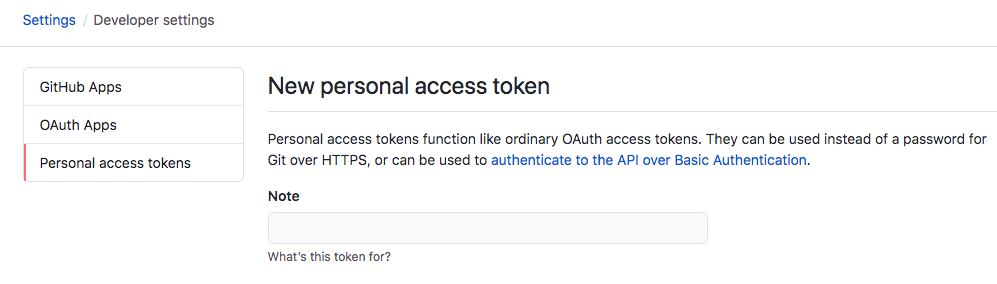
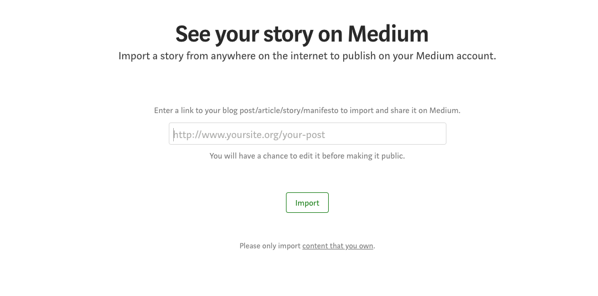
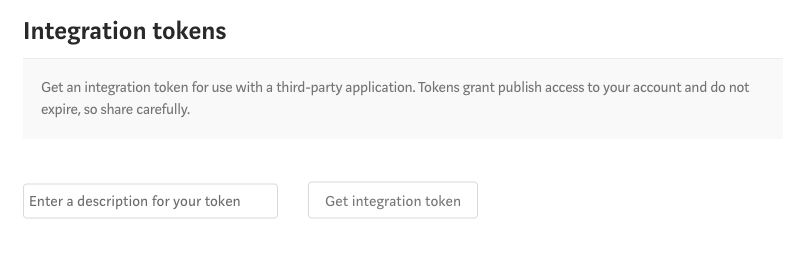

I started blogging with medium a while ago and I find their code block format is not ideal. After a few searches and clicks in google, I soon find out tech blogs are using gist as a great tool to embed code blocks into medium blog post. Then I started using it as well, it formats code, highlight keywords, has line numbers and a horizontal scroll bar if the line of code is too long. This is super cool for a tech guy like me, I enjoyed it so much. 

The steps that I have to do is, copy & paste my code into gist and save that as a file in gist. 

Now that this is done, all you need to do is copy the link to your gist and embed it in medium using the embed link option.

The medium gives you a nicely formatted code blocks. Hooray!

The only hassle is if you have multiple code blocks in one single post, you have to repeat the same steps over and over again and also don't get confused which code block goes where.

So I have been thinking how to reduce the repetition and make writting blog post more efficiently. Here is what I did,

I write my blogs in markdown (because I always try to keep my post independently to any platform or blog engines) and create a tool to convert code blocks to gist links that can be shared to medium.

The tool is called [MD-Gist](https://www.nuget.org/packages/MD-Gist/), it can be found in nuget.org

It does two things (well actually more than just two things, I will write more blogs about other features later on):

first it scan your post, and discover all the code blocks within the backtick blocks.

then it creates a gist file with the code block and replace the code with a gist url.

finally, you can import your post (in markdown format) to meidum without any hassle. Medium allows writers to import post via a url. as I am keeping my posts in github repository and I can just copy and paste that file's (e.g. <MyPost>.md) url to medium and click "import".

If you have **Integration tokens** setup in medium, you can also use the [MD-Gist](https://www.nuget.org/packages/MD-Gist/) tool to import as well. 

Or even better to create a git action, once you pushed your post to your github repository, the git action will automatically convert your code blocks with gist links and import to medium. 

---

How cool is that! 

I am going to show you all of it.

## Install [MD-Gist](https://www.nuget.org/packages/MD-Gist/)

- Using `dotnet tool install --global MD-Gist` to install the console tool from nuget 

``` shell
$ dotnet tool install --global MD-Gist
```

Just type `md-gist` in your terminal and if it is successfully installed, it should show you the help docs. 

---

## Create github access token

Because we need to access gist to create files, so I go to [Github Create Access Token](https://github.com/settings/tokens/new) to create a new token.



And make sure you select the Gist scope.


## Convert code blocks to gist and import to medium

I have to get my blog post markdown file ready to be converted, e.g. I have a blog post called **my-blog-post.md**

Then let's use [MD-Gist](https://www.nuget.org/packages/MD-Gist/) to convert the code blocks by entering the command

``` bash
$ md-gist parse -f=<Path> -t=<Github_Auth_Token>
```

The `<Path>` parameter can be a folder or a file, if it is a folder, [MD-Gist](https://www.nuget.org/packages/MD-Gist/) will try to convert all the `.md` files in it.

Also you are required to enter the `<Github_Auth_Token>` you just created in the previous step, that allows [MD-Gist](https://www.nuget.org/packages/MD-Gist/) to access gist and do the conversion job.

If the command successfully run, you would see a number of generated `.md` files. e.g.

```
my-blog-post-[Dev.to].md
my-blog-post-[Hugo].md
my-blog-post-[Medium].md
my-blog-post-[Jekyll].md
my-blog-post.md
```

Sorry I didn't mention it works for other blog engines as well, I mean they all have different formats to embed gist links (e.g. hugo blog is using something like``). But for medium, it is just purely a link, and meidum will do the rest while importing.

And **my-blog-post-[Medium].md** is your candidate to import to medium. Of course you have to push your post online that medium can access it. (I pushed my post to a github repository and get the shareable link, you can also use gist to save your post online.)




## Import to medium via command [MD-Gist](https://www.nuget.org/packages/MD-Gist/)

First you need to create medium integration token in [account settings](https://medium.com/me/settings)



Then enter the command

```
$ md-gist medium -f=<Files Path> -t=<Medium Access Token> -s=<Status draft/publish>
```
Please target the `<Files Path>` with generated `my-blog-post-[Medium].md` for best outcome.

## Automate conversion using github action

This github action that will automatically detect any .md files and convert the code blocks to gist embeded code and pushed these new files to the repository as well.

```
    - name: Parse markdown
      working-directory: ./Blogs
      run: | 
        dotnet tool install --global MD-Gist
        md-gist parse -t=${{secrets.GIST_TOKEN}}        
        git config --local user.email "action@github.com"
        git config --local user.name "GitHub Action"
        git add .
        git commit -m "Add changes" -a
    - name: Push changes
        uses: ad-m/github-push-action@master
        with:
            github_token: ${{ secrets.GIST_TOKEN }}
```

It will create these files that you can publish directly in these blogging platforms

```
my-blog-post-[Dev.to].md
my-blog-post-[Hugo].md
my-blog-post-[Jekyll].md
my-blog-post-[Medium].md
```

## Finally

If you find my article is helpful, please click **Applaud** to support me.

Here is the link to GitHub to grab the complete source code for the app.

https://github.com/superwalnut/markdown-gist-transform